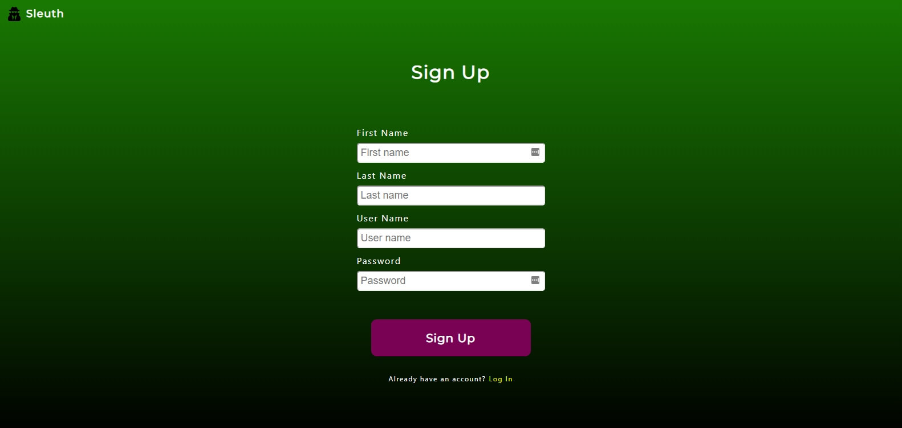
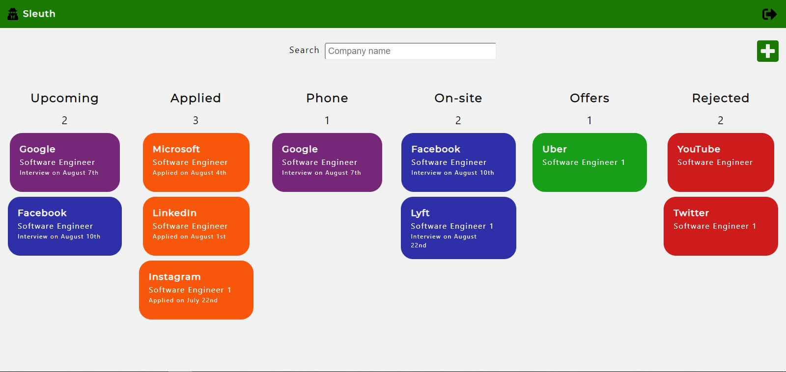
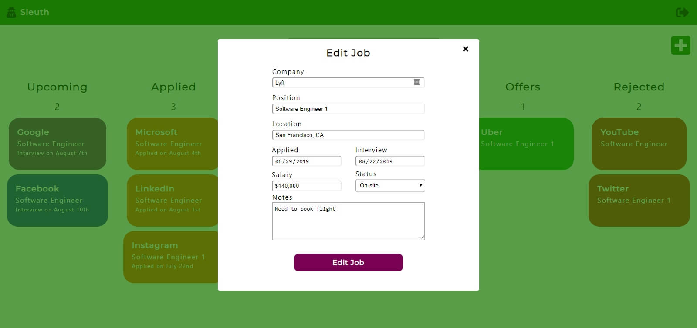
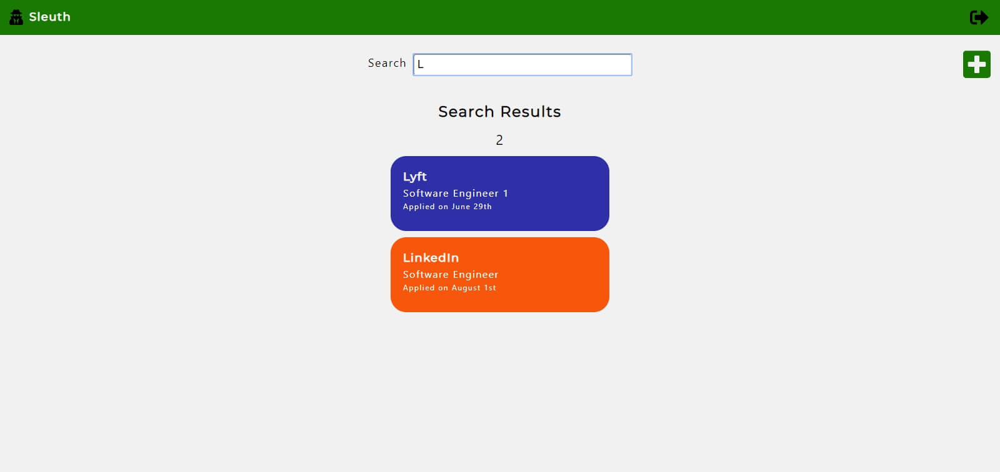

# Sleuth - A Tracker App for the Job Hunt

## Demo User Credentials
* Username: demoUser
* Password: !2#4QwEr

## Live Site:
* https://sleuth-app.mcelroywes.now.sh/

## Screenshots:

### Landing Page:

### Sign Up Page:

### Dashboard:

### Edit Job:

### Search Job:

## Motivation
It can be difficult for job hunters to keep track of all of the jobs they've applied to, so I wanted to create an
app that allow users to store all of their job information in one place with some additional features that they
wouldn't have by using a simple spreadsheet.

## Summary
This app allows users to store all of the information regarding the jobs they've applied to on a password-protected
dashboard. Users can create, read, edit, and delete an unlimited number of job application entries, see all interviews
that are scheduled within seven days, and utilize a search feature to find information regarding a specific job they've
applied to.

## Technologies Used
* HTML
* CSS
* JavaScript
* React
* Node
* Express
* PostgreSQL